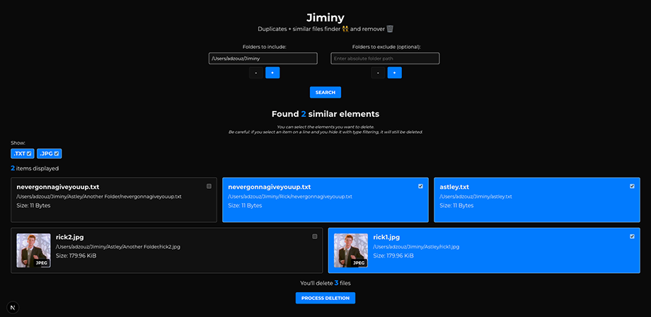

# 👯‍♀️ Jiminy

Little web app to help you finding duplicate files and similar images across folders and remove them. 🗑️✨

Made with [Next.js](https://nextjs.org) _(with Pages Router)_.



## 🛠️ Installation

### 1️⃣ Prerequisites

- [Node.js](https://nodejs.org/) (used with version `22.14.0`)
- [npm](https://www.npmjs.com/) (used with version `10.9.2`)

_Volta is configured and version pinned in the package.json_

### 2️⃣ Install dependencies

Clone the repo and install dependencies by running the following command:

```sh
git clone https://github.com/Adzouz/Jiminy.git jiminy
cd jiminy
npm install
```

_⚠️ IMPORTANT: If you're running this app on Windows, you'll also need to install [ImageMagick](https://imagemagick.org/script/download.php) and make sure the command is available from your CLI._

## 🏃‍➡️ Run project

To run the project locally, use the following command:

```bash
npm run dev
```

The app should start and run on port 3000.

Go to your browser and open [http://localhost:3000](http://localhost:3000) to start using the app.

There's only one page for the app but there's also an API (`/api/*`) called by the app to run background processes:

- **/api/delete** will delete the filesToDelete passed in the body _(for the object props, see typing interface on top of the api route file)_.
- **/api/image** will fetch and send back the image based on the absolute path (fullPath: string) sent in the URL query.
- **/api/search** will explore the list of folderPathsToInclude _(string[])_ to find duplicates and similar images (possible to also give a folderPathsToExclude to skip specific folders).

_⚠️ Use this API at your own risk._

_⚠️ Be careful to be sure about what you're doing and test the tool correctly before to familiarize with it. We're not responsible for wrong data deletion._

This project uses [`next/font`](https://nextjs.org/docs/pages/building-your-application/optimizing/fonts).

---

## 📝 Additional scripts

```sh
npm run lint
```

---

## 🚀 Deployment

To prepare the app for production, run the following command:

```sh
npm run build
```
---

## 📦 Stack

- ⚛️ **React**
- 🔗 **Next.JS**
- 🎨 **Sass**
- 🔬 **Sharp + heic-convert** _(for image manipulation)_
- 🛠️ **ESLint + Prettier**

---

## 👨‍💻 Contribute

1. **Fork** the repo
2. **Create a new fix or feature branch** : `git checkout -b {feat|fix}/update-name`
3. **Commit** : `git commit -m "{feat|fix}: changes description"`
4. **Push** : `git push origin {feat|fix}/update-name`
5. **Open a Pull Request**
